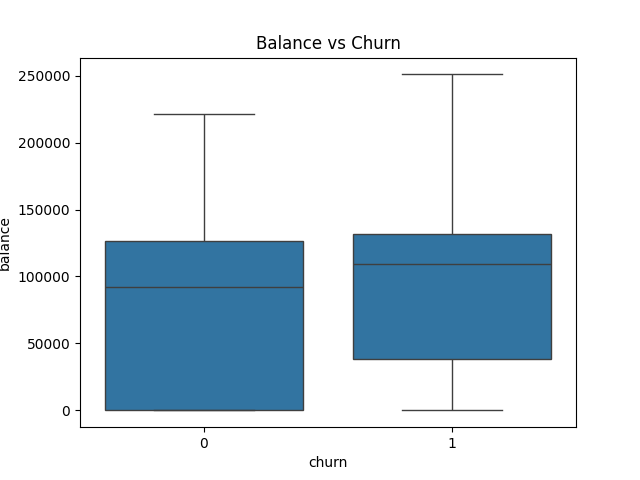

# Bank Customer Churn Prediction

Predicting which bank customers are likely to leave (churn) using financial and demographic data.

## Features
- Logistic Regression model
- Data cleaning & feature encoding
- Feature scaling
- Model evaluation (classification report, confusion matrix)
- Visualizations

## Visualizations

### Churn Distribution


### Balance vs Churn


### Confusion Matrix


### Tableau Dashboard

I also built an interactive Tableau dashboard to explore these patterns with filters and KPIs.

📖 Medium article:
https://lnkd.in/eSbqHByj

📊 Interactive Tableau dashboard:
https://lnkd.in/e7iKrjFP

I’d love feedback from anyone working in data, analytics, or product — always looking to learn and improve.

## How to Run
1. Clone the repo  
2. Install dependencies:
   ```bash
   pip install pandas scikit-learn matplotlib seaborn
